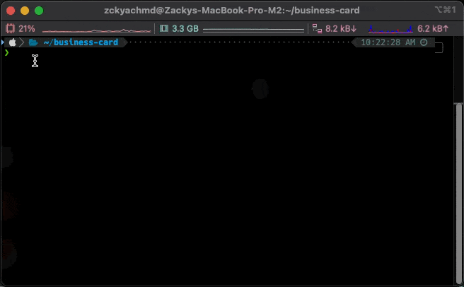

# Zacky's NPX Card

Welcome to Zacky's NPX Card – a unique way to connect with me directly via your console or terminal!

## How to use it?

1. Open your terminal.
2. Type `npx zckyachmd` and hit enter.
3. You will see my business card in your terminal.

  
Preview

  

## How to create your own NPX Card?

The piece authored by @jackboberg served as my point of reference for deploying the package, as detailed in [Creating a Basic npx Business Card](https://studioelsa.se/blog/open-source-oss-npx-business-card).
